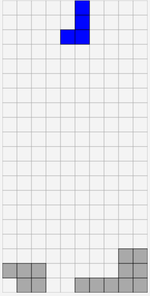

# Change Log

## 2025.01.06

Update the logic, check the destination could be reached.

## 2025.01.03

### Generate First Version auto robot

- Operate two threads: one for the game engine and another for the robot.
- Initial Approach
  - Each piece has at most 4 shapes, corresponding to its rotations. 
  - Iterate through the grid, scanning from bottom to top and from left to right. 
  - Check if the shape can be placed. (Note: Sometimes the shape cannot move to the desired location.)

## 2025.01.02

### Completed the game engine

- Completed the game UI
- Completed the game engine
- Added Score and time clock.